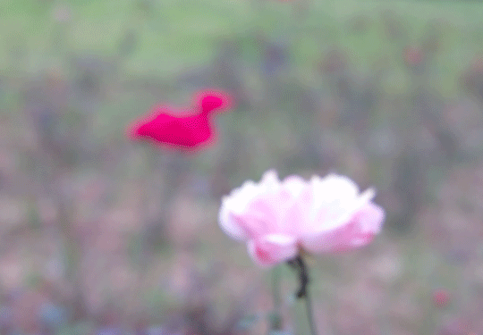
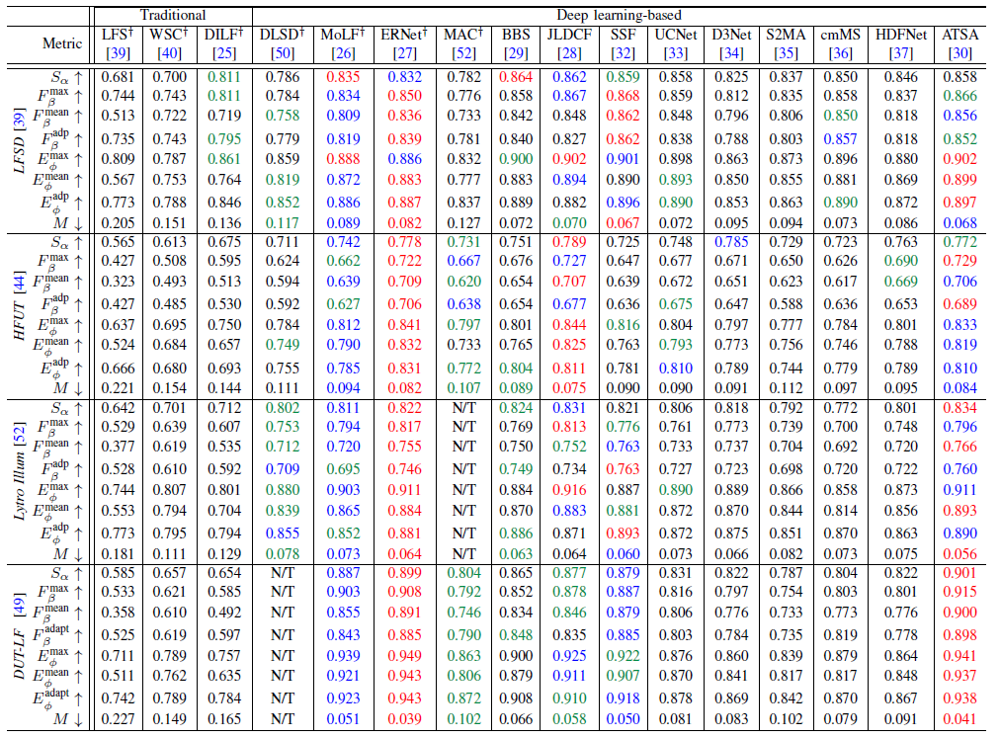
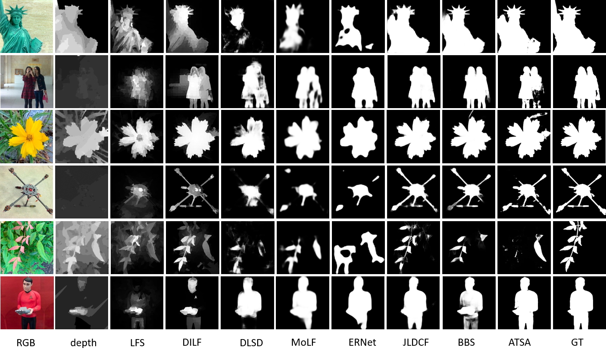
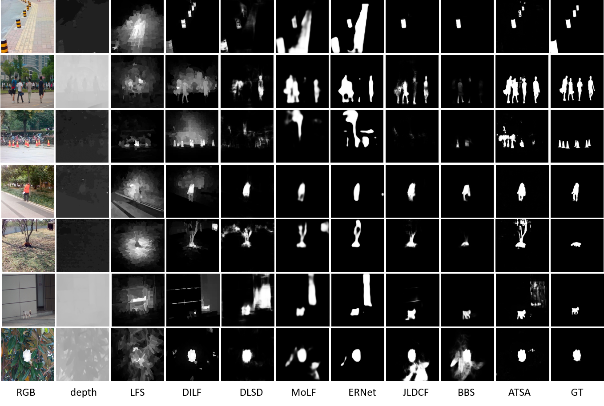

# Light Field Salient Object Detection: A Review and Benchmark [[PDF](https://arxiv.org/pdf/2010.04968.pdf)]
(THIS PROJECT SITE IS UNDER CONSTRUCTION...)

# Light Field

## Multi-view Images and Focal Stacks

* A GIF animation of multi-view images in Lytro Illum.

* A GIF animation of a focal stack in Lytro Illum.

# Light Field SOD
## Traditional Models
Table I: Overview of traditional LFSOD models.

| No.  | Year | Model | pub.   | Title                                                        | Links         |
| ---- | ---- | ------ | ------ | ------------------------------------------------------------ | ------------- |
| 1    | 2014 | LFS    | CVPR   | Saliency Detection on Light Field                            | [Paper](https://sites.duke.edu/nianyi/files/2020/06/Li_Saliency_Detection_on_2014_CVPR_paper.pdf)/[Project](https://sites.duke.edu/nianyi/publication/saliency-detection-on-light-field/) |
| 2    | 2015 | WSC    | CVPR   | A Weighted Sparse Coding Framework for Saliency Detection    | [Paper](https://openaccess.thecvf.com/content_cvpr_2015/papers/Li_A_Weighted_Sparse_2015_CVPR_paper.pdf)/[Project](https://www.researchgate.net/publication/294874666_Code_WSC) |
| 3    | 2015 | DILF   | IJCAI  | Saliency Detection with a Deeper Investigation of Light Field |[Paper](https://www.ijcai.org/Proceedings/15/Papers/313.pdf)/[Project](https://github.com/pencilzhang/lightfieldsaliency_ijcai15) |
| 4    | 2016 | RL     | ICASSP | Relative location for light field saliency detection         | [Paper](http://sites.nlsde.buaa.edu.cn/~shenghao/Download/publications/2016/11.Relative%20location%20for%20light%20field%20saliency%20detection.pdf)/Project |
| 5    | 2017 | BIF    | NPL    | A Two-Stage Bayesian Integration Framework for Salient Object  Detection on Light Field | [Paper](https://link.springer.com/article/10.1007/s11063-017-9610-x)/Project |
| 6    | 2017 | LFS    | TPAMI  | Saliency Detection on Light Field                            | [Paper](https://ieeexplore.ieee.org/document/7570181)/[Project](https://sites.duke.edu/nianyi/publication/saliency-detection-on-light-field/) |
| 7    | 2017 | MA     | TOMM   | Saliency Detection on Light Field: A Multi-Cue Approach      | [Paper](http://www.linliang.net/wp-content/uploads/2017/07/ACMTOM_Saliency.pdf)/Project |
| 8    | 2018 | SDDF   | MTAP   | Accurate saliency detection based on depth feature of 3D images              | [Paper](https://link.springer.com/article/10.1007%2Fs11042-017-5052-8)/Project |
| 9    | 2018 | SGDC   | CVPR   | Salience Guided Depth Calibration for Perceptually Optimized  Compressive Light Field 3D Display | [Paper](https://ieeexplore.ieee.org/document/8578315/)/Project |
| 10   | 2020 | RDFD   | MTAP   | Region-based depth feature descriptor for saliency detection  on light field | [Paper](https://link.springer.com/article/10.1007%2Fs11042-020-08890-x)/Project |
| 11   | 2020 | DCA    | TIP    | Saliency Detection via Depth-Induced Cellular Automata on  Light Field | [Paper](https://ieeexplore.ieee.org/document/8866752)/Project |

## Deep Learning-based Models

Fig. 1 Frameworks of deep light field SOD models. (a) Late-fusion ([DLLF](https://openaccess.thecvf.com/content_ICCV_2019/papers/Wang_Deep_Learning_for_Light_Field_Saliency_Detection_ICCV_2019_paper.pdf), [MTCNet](https://ieeexplore.ieee.org/abstract/document/9153018)). (b) Middle-fusion ([MoLF](https://papers.nips.cc/paper/8376-memory-oriented-decoder-for-light-field-salient-object-detection.pdf), [LFNet](https://ieeexplore.ieee.org/document/9082882)). (c) Knowledge distillation-based ([ERNet](https://www.aiide.org/ojs/index.php/AAAI/article/view/6860)). (d) Reconstruction-based ([DLSD](https://www.ijcai.org/Proceedings/2019/0127.pdf)). (e) Single-stream ([MAC](https://arxiv.org/pdf/1906.08331.pdf)). Note that (a) utilizes the focal stack/multi-view images and all-in-focus/center view image, while (b)-(c) utilize the
focal stack and all-in-focus image. (d)-(e) utilize the center-view image and micro-lens image array.

Table II: Overview of deep learning-based LFSOD models.

| No.  | Year | Model  | pub.   | Title                                                        | Links         |
| ---- | ---- | ------ | ------ | ------------------------------------------------------------ | ------------- |
| 1    | 2019 | DLLF   | ICCV   | Deep Learning for Light Field Saliency Detection             | [Paper](https://openaccess.thecvf.com/content_ICCV_2019/papers/Wang_Deep_Learning_for_Light_Field_Saliency_Detection_ICCV_2019_paper.pdf)/[Project](https://github.com/OIPLab-DUT/ICCV2019_Deeplightfield_Saliency) |
| 2    | 2019 | DLSD   | IJCAI  | Deep Light-field-driven Saliency Detection from a Single View | [Paper](https://www.ijcai.org/Proceedings/2019/0127.pdf)/Project |
| 3    | 2019 | MoLF   | NIPS   | Memory-oriented Decoder for Light Field Salient Object  Detection | [Paper](https://papers.nips.cc/paper/8376-memory-oriented-decoder-for-light-field-salient-object-detection.pdf)/[Project](https://github.com/OIPLab-DUT/MoLF) |
| 4    | 2020 | ERNet  | AAAI   | Exploit and Replace: An Asymmetrical Two-Stream Architecture  for Versatile Light Field Saliency Detection | [Paper](https://www.aiide.org/ojs/index.php/AAAI/article/view/6860)/[Project](https://github.com/OIPLab-DUT/AAAI2020-Exploit-and-Replace-Light-Field-Saliency) |
| 5    | 2020 | LFNet  | TIP    | LFNet: Light Field Fusion Network for Salient Object Detection | [Paper](https://ieeexplore.ieee.org/document/9082882)/Project |
| 6    | 2020 | MAC   | TIP    | Light Field Saliency Detection with Deep Convolutional Networks | [Paper](https://arxiv.org/pdf/1906.08331.pdf)/[Project](https://github.com/pencilzhang/MAC-light-field-saliency-net) |
| 7    | 2020 | MTCNet   | TCSVT    | A Multi-Task Collaborative Network for Light Field Salient Object Detection | [Paper](https://ieeexplore.ieee.org/abstract/document/9153018)/Project |

## Other Review Works

Table III: Overview of related reviews and surveys to LFSOD.

| No.  | Year | Model  | pub.   | Title                                                        | Links         |
| ---- | ---- | ------ | ------ | ------------------------------------------------------------ | ------------- |
| 1    | 2015 | CS     | NEURO  | Light field saliency vs.2D saliency : A comparative study    | [Paper](https://www.sciencedirect.com/science/article/abs/pii/S0925231215003410?via%3Dihub)/Project |
| 2    | 2020 |RGBDS   | CVM    | RGB-D Salient Object Detection: A Survey                     | [Paper](https://arxiv.org/pdf/2008.00230.pdf)/[Project](https://github.com/taozh2017/RGBD-SODsurvey) |

# LFSOD Datasets

Table IV: Overview of light field SOD datasets. About the abbreviations: MOP=Multiple-Object Proportion (The percentage of images regarding the entire dataset, which have more than one objects per image), FS=Focal Stacks, DE=Depth maps, MV=Multi-view images, ML=Micro-lens images, GT=Ground-truth, Raw=Raw light field data. FS, MV, DE, ML, GT and Raw indicate the data provided by the datasets. `'✓' denotes the data forms provided in the original datasets, while '✔️' indicates the data forms generated by us`. Original data forms as well as supplement data forms can be download at 'All Download'. You can also download original dataset in 'Original Link'.

| No.  | Dataset     | Year | Pub.     | Size | MOP  | FS   | MV   | DE   | ML   | GT   | Raw  | Download | Original Link |
| ---- | ----------- | ---- | -------- | ---- | ---- | ---- | ---- | ---- | ---- | ---- | ---- | -------- | ------------- |
| 1    | LFSD        | 2014 | CVPR     | 100  | 0.04 | ✓    | ✔️  |   ✓  | ✔️   |   ✓  |  ✓  | [Coming soon]() | [Link](https://sites.duke.edu/nianyi/publication/saliency-detection-on-light-field/)    |
| 2    | HFUT        | 2017 | ACM TOMM | 255  | 0.29 | ✓ | ✓ | ✓ |    ✔️  |✓  |      | [Coming soon]() | [Link](https://github.com/pencilzhang/MAC-light-field-saliency-net)    |
| 3    | DUT-LF      | 2019 | ICCV     | 1462 | 0.05 |✓  |      |✓  |      |✓  |      | [Coming soon]() | [Link](https://github.com/OIPLab-DUT/ICCV2019_Deeplightfield_Saliency)   |
| 4    | DUT-MV      | 2019 | IJCAI    | 1580 | 0.04 |      |✓  |      |      |✓  |      | [Coming soon]() | [Link](https://github.com/OIPLab-DUT/IJCAI2019-Deep-Light-Field-Driven-Saliency-Detection-from-A-Single-View)     |
| 5    | Lytro Illum | 2020 | IEEE TIP | 640  | 0.15 |   ✔️   |    ✔️  |    ✔️  |✓  |✓  |✓  | [Coming soon]() | [Link](https://github.com/pencilzhang/MAC-light-field-saliency-net)     |

# Benchmarking Results

## Appendix: RGB-D Models in Our Tests

Table V: Overview of RGB-D SOD models in our tests.

| No.  | Year | Model | Pub.       | Title                                                        | Links                                                        |
| ---- | ---- | ------ | ---------- | ------------------------------------------------------------ | ------------------------------------------------------------ |
| 1    | 2020 | BBS    | ECCV       | BBS-Net: RGB-D Salient Object Detection with a Bifurcated Backbone Strategy Network | [Paper](https://arxiv.org/pdf/2007.02713.pdf)/[Project](https://github.com/zyjwuyan/BBS-Net) |
| 2    | 2020 | JLDCF  | CVPR       | JL-DCF: Joint learning and densely-cooperative fusion framework for RGB-D salient object detection | [Paper](https://openaccess.thecvf.com/content_CVPR_2020/papers/Fu_JL-DCF_Joint_Learning_and_Densely-Cooperative_Fusion_Framework_for_RGB-D_Salient_CVPR_2020_paper.pdf)/[Project](https://github.com/kerenfu/JLDCF) |
| 3    | 2020 | SSF    | CVPR       | Select, supplement and focus for RGB-D saliency detection    | [Paper](https://openaccess.thecvf.com/content_CVPR_2020/papers/Zhang_Select_Supplement_and_Focus_for_RGB-D_Saliency_Detection_CVPR_2020_paper.pdf)/[Project](https://github.com/OIPLab-DUT/CVPR_SSF-RGBD) |
| 4    | 2020 | UCNet  | CVPR       | UC-Net: Uncertainty Inspired RGB-D Saliency Detection via Conditional Variational Autoencoders | [Paper](https://openaccess.thecvf.com/content_CVPR_2020/papers/Zhang_UC-Net_Uncertainty_Inspired_RGB-D_Saliency_Detection_via_Conditional_Variational_Autoencoders_CVPR_2020_paper.pdf)/[Project](https://github.com/JingZhang617/UCNet) |
| 5    | 2020 | D3Net  | IEEE TNNLS | Rethinking RGB-D salient object detection: models, datasets, and large-scale benchmarks | [Paper](https://arxiv.org/pdf/1907.06781.pdf)/[Project](https://github.com/DengPingFan/D3NetBenchmark) |
| 6    | 2020 | S2MA   | CVPR       | Learning selective self-mutual attention for RGB-D saliency detection | [Paper](https://openaccess.thecvf.com/content_CVPR_2020/papers/Liu_Learning_Selective_Self-Mutual_Attention_for_RGB-D_Saliency_Detection_CVPR_2020_paper.pdf)/[Project](https://github.com/nnizhang/S2MA) |
| 7    | 2020 | cmMS   | ECCV       | RGB-D salient object detection with cross-modality modulation and selection | [Paper](https://arxiv.org/pdf/2007.07051.pdf)/[Project](https://github.com/Li-Chongyi/cmMS-ECCV20) |
| 8    | 2020 | HDFNet | ECCV       | Hierarchical Dynamic Filtering Network for RGB-D Salient Object Detection | [Paper](https://arxiv.org/pdf/2007.06227.pdf)/[Project](https://github.com/lartpang/HDFNet) |
| 9    | 2020 | ATSA   | ECCV       | Asymmetric Two-Stream Architecture for Accurate RGB-D Saliency Detection | [Paper](https://www.ecva.net/papers/eccv_2020/papers_ECCV/papers/123730375.pdf)/[Project](https://github.com/sxfduter/ATSA) |

## Quantitative Comparison

Table VI: Quantitative measures: S-measure (*S&alpha;*), max F-measure (*F&beta;max*), mean F-measure (*F&beta;mean*), adaptive F-measure (*F&beta;adp*), max E-measure (*E&Phi;max*), mean E-measure (*E&Phi;mean*), adaptive E-measure (*E&Phi;adp*), and MAE (*M*) of seven light field SOD models (i.e., [LFS](https://sites.duke.edu/nianyi/files/2020/06/Li_Saliency_Detection_on_2014_CVPR_paper.pdf), [WSC](https://openaccess.thecvf.com/content_cvpr_2015/papers/Li_A_Weighted_Sparse_2015_CVPR_paper.pdf), [DILF](https://www.ijcai.org/Proceedings/15/Papers/313.pdf), [DLSD](https://www.ijcai.org/Proceedings/2019/0127.pdf), [MoLF](https://papers.nips.cc/paper/8376-memory-oriented-decoder-for-light-field-salient-object-detection.pdf), [ERNet](https://www.aiide.org/ojs/index.php/AAAI/article/view/6860), [MAC](https://arxiv.org/pdf/1906.08331.pdf)) and nine SOTA RGB-D based SOD models (i.e., [BBS](https://arxiv.org/pdf/2007.02713.pdf), [JLDCF](https://openaccess.thecvf.com/content_CVPR_2020/papers/Fu_JL-DCF_Joint_Learning_and_Densely-Cooperative_Fusion_Framework_for_RGB-D_Salient_CVPR_2020_paper.pdf), [SSF](https://openaccess.thecvf.com/content_CVPR_2020/papers/Zhang_Select_Supplement_and_Focus_for_RGB-D_Saliency_Detection_CVPR_2020_paper.pdf), [UCNet](https://openaccess.thecvf.com/content_CVPR_2020/papers/Zhang_UC-Net_Uncertainty_Inspired_RGB-D_Saliency_Detection_via_Conditional_Variational_Autoencoders_CVPR_2020_paper.pdf), [D3Net](https://arxiv.org/pdf/1907.06781.pdf), [S2MA](https://openaccess.thecvf.com/content_CVPR_2020/papers/Liu_Learning_Selective_Self-Mutual_Attention_for_RGB-D_Saliency_Detection_CVPR_2020_paper.pdf), [cmMS](https://arxiv.org/pdf/2007.07051.pdf), [HDFNet](https://arxiv.org/pdf/2007.06227.pdf), and [ATSA](https://www.ecva.net/papers/eccv_2020/papers_ECCV/papers/123730375.pdf)).  
*Note in the table, light field SOD models are marked by "&dagger;". Symbol “N/T” indicates that a model was trained on quite some images from the corresponding dataset, and, thus, it is not tested. The top three models among light field and RGB-D based SOD models are highlighted in `red`, `blue` and `green`, `separately`. &uarr;/&darr; denotes that a larger/smaller value is better.*

Fig. 2 PR curves on four datasets ((a) LFSD, (b) HFUT, (c) Lytro Illum, and (d) DUT-LF) for seven light field SOD models (i.e., [LFS](https://sites.duke.edu/nianyi/files/2020/06/Li_Saliency_Detection_on_2014_CVPR_paper.pdf), [WSC](https://openaccess.thecvf.com/content_cvpr_2015/papers/Li_A_Weighted_Sparse_2015_CVPR_paper.pdf), [DILF](https://www.ijcai.org/Proceedings/15/Papers/313.pdf), [DLSD](https://www.ijcai.org/Proceedings/2019/0127.pdf), [MoLF](https://papers.nips.cc/paper/8376-memory-oriented-decoder-for-light-field-salient-object-detection.pdf), [ERNet](https://www.aiide.org/ojs/index.php/AAAI/article/view/6860), [MAC](https://arxiv.org/pdf/1906.08331.pdf)) and nine SOTA RGB-D based SOD models (i.e., [BBS](https://arxiv.org/pdf/2007.02713.pdf), [JLDCF](https://openaccess.thecvf.com/content_CVPR_2020/papers/Fu_JL-DCF_Joint_Learning_and_Densely-Cooperative_Fusion_Framework_for_RGB-D_Salient_CVPR_2020_paper.pdf), [SSF](https://openaccess.thecvf.com/content_CVPR_2020/papers/Zhang_Select_Supplement_and_Focus_for_RGB-D_Saliency_Detection_CVPR_2020_paper.pdf), [UCNet](https://openaccess.thecvf.com/content_CVPR_2020/papers/Zhang_UC-Net_Uncertainty_Inspired_RGB-D_Saliency_Detection_via_Conditional_Variational_Autoencoders_CVPR_2020_paper.pdf), [D3Net](https://arxiv.org/pdf/1907.06781.pdf), [S2MA](https://openaccess.thecvf.com/content_CVPR_2020/papers/Liu_Learning_Selective_Self-Mutual_Attention_for_RGB-D_Saliency_Detection_CVPR_2020_paper.pdf), [cmMS](https://arxiv.org/pdf/2007.07051.pdf), [HDFNet](https://arxiv.org/pdf/2007.06227.pdf), and [ATSA](https://www.ecva.net/papers/eccv_2020/papers_ECCV/papers/123730375.pdf)). `Note that in this figure, the solid lines and dashed lines represent the PR curves of RGB-D based SOD models and light field SOD models, respectively. `

## Qualitative Comparison

Fig. 3 Visual comparison of five light field SOD (i.e., [LFS](https://sites.duke.edu/nianyi/files/2020/06/Li_Saliency_Detection_on_2014_CVPR_paper.pdf), [DILF](https://www.ijcai.org/Proceedings/15/Papers/313.pdf), [DLSD](https://www.ijcai.org/Proceedings/2019/0127.pdf), [MoLF](https://papers.nips.cc/paper/8376-memory-oriented-decoder-for-light-field-salient-object-detection.pdf), [ERNet](https://www.aiide.org/ojs/index.php/AAAI/article/view/6860)) and
three SOTA RGB-D based SOD models (i.e., [JLDCF](https://openaccess.thecvf.com/content_CVPR_2020/papers/Fu_JL-DCF_Joint_Learning_and_Densely-Cooperative_Fusion_Framework_for_RGB-D_Salient_CVPR_2020_paper.pdf), [BBS](https://arxiv.org/pdf/2007.02713.pdf), and [ATSA](https://www.ecva.net/papers/eccv_2020/papers_ECCV/papers/123730375.pdf)). `The first two rows in this figure show easy cases while the third to fifth rows show cases with complex backgrounds or sophisticated boundaries. The last row gives an example with low color contrast between foreground and background.`

Fig. 4 Visual comparison of five light field SOD (i.e., [LFS](https://sites.duke.edu/nianyi/files/2020/06/Li_Saliency_Detection_on_2014_CVPR_paper.pdf), [DILF](https://www.ijcai.org/Proceedings/15/Papers/313.pdf), [DLSD](https://www.ijcai.org/Proceedings/2019/0127.pdf), [MoLF](https://papers.nips.cc/paper/8376-memory-oriented-decoder-for-light-field-salient-object-detection.pdf), [ERNet](https://www.aiide.org/ojs/index.php/AAAI/article/view/6860)) and
three SOTA RGB-D based SOD models (i.e., [JLDCF](https://openaccess.thecvf.com/content_CVPR_2020/papers/Fu_JL-DCF_Joint_Learning_and_Densely-Cooperative_Fusion_Framework_for_RGB-D_Salient_CVPR_2020_paper.pdf), [BBS](https://arxiv.org/pdf/2007.02713.pdf), and [ATSA](https://www.ecva.net/papers/eccv_2020/papers_ECCV/papers/123730375.pdf)) on detecting multiple (first three rows) and small objects (remaining rows). 

# Citation
Please cite our paper if you find the work useful: 

	@article{jiang2020light,
  	title={Light Field Salient Object Detection: A Review and Benchmark},
  	author={Jiang, Yao and Zhou, Tao and Ji, Ge-Peng and Fu, Keren and Zhao, Qijun and Fan, Deng-Ping},
  	journal={arXiv preprint arXiv:2010.04968},
  	year={2020}
	}

